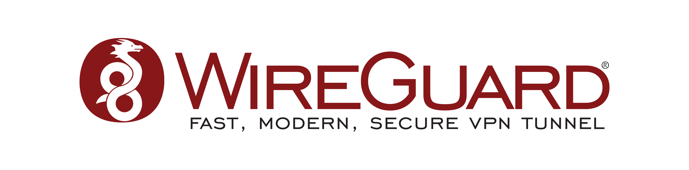

<div align="center">



# WireGuard VPN — MK-AUTH Addon

**Gerenciamento completo de VPN WireGuard integrado ao painel MK-AUTH**

[](https://github.com/joseluisfreire/WireGuard-VPN-Addon/releases)
[](https://github.com/joseluisfreire/wg-mkauthd/releases)
[](https://github.com/joseluisfreire/wireguard-tools-static/releases)
[](LICENSE)

---

**Português (BR)** · [English](#english)

</div>

## 📋 Sobre

Addon para o sistema [MK-AUTH](https://mk-auth.com.br) que permite criar, gerenciar e monitorar túneis **WireGuard VPN** diretamente pelo painel web. Ideal para provedores de internet (ISPs) que utilizam MK-AUTH hospedado/configurado por conta própria em uma VPS (cloud) e precisam de uma solução VPN moderna, rápida e segura.

## 💡 Por que WireGuard?

O **WireGuard** é hoje o protocolo VPN mais moderno, seguro e eficiente disponível. Com apenas ~4.000 linhas de código (contra ~100.000 do OpenVPN e ~400.000 do IPsec), sua base enxuta facilita auditorias de segurança e reduz drasticamente a superfície de ataque. Utiliza criptografia de ponta: **Curve25519** para troca de chaves, **ChaCha20** para cifragem simétrica, **Poly1305** para autenticação e **BLAKE2s** para hashing.

### Adoção nativa em toda a stack

- **Linux Kernel** — WireGuard foi incorporado ao kernel Linux mainline na **versão 5.6** (março de 2020), após Linus Torvalds declarar: *"Posso mais uma vez declarar meu amor pelo WireGuard e esperar que seja mergeado logo? Comparado aos horrores do OpenVPN e IPsec, é uma obra de arte."* Todos os kernels desde então incluem suporte nativo — incluindo o **XanMod 6.12** presente na ISO mais recente do MK-AUTH.

- **Mikrotik RouterOS** — suporte ao WireGuard foi introduzido no **RouterOS 7.1beta2** (agosto de 2020) e está estável desde as primeiras releases do RouterOS 7.x. A partir do **RouterOS 7.19**, as funções de **`wg-import`** e **import por string** tornaram o provisionamento de peers extremamente simples — é possível importar configurações completas via QR Code ou arquivo diretamente no router.

### O problema real que este addon resolve

Apesar do WireGuard estar nativo tanto no kernel Linux quanto no RouterOS, o **MK-AUTH ainda não oferece suporte nativo** a este protocolo. Isso cria uma lacuna operacional crítica, especialmente considerando:

- **Ambientes cloud em crescimento** — cada vez mais provedores hospedam seu MK-AUTH em VPS/cloud (AWS, OCI, Hetzner, etc.), onde a conectividade VPN com as Mikrotiks do campo é essencial. O WireGuard é a escolha ideal por seu desempenho sobre UDP e baixo overhead.

- **PPTP não é mais aceitável** — muitos provedores ainda utilizam PPTP por ser "simples de configurar", mas este protocolo está **oficialmente depreciado pela Microsoft** (outubro de 2024) e é considerado **fundamentalmente inseguro**. O MS-CHAPv2 usado pelo PPTP é vulnerável a ataques de força bruta e dicionário, e a criptografia MPPE é trivialmente quebrável. Alguns provedores cloud até bloqueiam GRE (protocolo 47), inviabilizando completamente o PPTP.

- **Backup e restauração** — manter a configuração dos peers WireGuard sincronizada entre servidor e routers após uma reinstalação do MK-AUTH é extremamente difícil sem uma ferramenta dedicada. Diferente do PPTP, onde basta recriar usuários, no WireGuard cada peer possui um par de chaves criptográficas único que precisa ser preservado. Este addon resolve isso com **snapshots completos** e restauração com um clique.

## ✨ Funcionalidades

- 🖧 **Gerenciamento de Servidor** — criar, iniciar, parar e resetar interfaces WireGuard
- 👥 **Gerenciamento de Peers** — criar, editar, ativar/desativar e remover clientes VPN
- 📡 **Provisionamento por Ramal** — vincular peers WireGuard a ramais Mikrotik do MK-AUTH
- 📦 **Backup & Restore** — snapshots completos da configuração WireGuard
- 📊 **Dashboard** — status do servidor, peers conectados, tráfego em tempo real
- 🔄 **Importação em Massa** — importar configurações existentes
- 🗑️ **Operações em Lote** — desativar/remover múltiplos peers de uma vez
- 🔐 **Segurança** — comunicação via Unix socket, sem portas expostas

## 🏗️ Arquitetura

```text
┌──────────────────────────────────────────────────────────┐
│                  MK-AUTH (Painel Web)                    │
│                                                          │
│  addon_wireguard.js ──► /addons/wireguard/index.php      │
│                              │                           │
│                     wg_actions_post.php                  │
│                              │                           │
└──────────────────────────────┼───────────────────────────┘
                               │
                        Unix Socket
                    /run/wgmkauth.sock
                               │
                               ▼
                     ┌─────────────────┐
                     │   wg-mkauthd    │
                     │  (daemon Go)    │
                     └────────┬────────┘
                              │
                     ┌────────▼────────┐
                     │ wireguard-tools │
                     │  wg · wg-quick  │
                     └────────┬────────┘
                              │
                     ┌────────▼────────┐
                     │    WireGuard    │
                     │    (kernel)     │
                     └─────────────────┘

```


## 📦 Componentes

| Componente | Descrição | Repositório |
|---|---|---|
| **WireGuard VPN Addon** | Interface PHP/JS/CSS integrada ao MK-AUTH | [Este repo](https://github.com/joseluisfreire/WireGuard-VPN-Addon) |
| **wg-mkauthd** | Daemon em Go — bridge entre PHP e wireguard-tools via Unix socket | [wg-mkauthd](https://github.com/joseluisfreire/wg-mkauthd) |
| **wireguard-tools-static** | `wg` e `wg-quick` compilados estaticamente (zero dependências) | [wireguard-tools-static](https://github.com/joseluisfreire/wireguard-tools-static) |

## ⚡ Instalação Rápida

```bash
curl -fsSL https://raw.githubusercontent.com/joseluisfreire/WireGuard-VPN-Addon/main/bootstrap.sh | bash
```
⚠️ Requisitos: MK-AUTH 25.05+ · Kernel com suporte WireGuard (5.6+ ou XanMod 6.12)

O que o instalador faz:
Detecta a arquitetura do sistema (amd64/arm64)
Baixa e instala wg e wg-quick (binários estáticos)
Baixa e instala o daemon wg-mkauthd
Copia os arquivos do addon para /opt/mk-auth/admin/addons/
Cria o symlink addons.class.php
Configura o serviço SysVinit wg-mkauthd
Inicia o daemon e valida a instalação
---

```markdown
## 🔧 Instalação Manual

<details>
<summary>Clique para expandir</summary>

### 1. Clonar o repositório

```bash
cd /tmp
git clone https://github.com/joseluisfreire/WireGuard-VPN-Addon.git
cd WireGuard-VPN-Addon
```

2. Copiar arquivos do addon
```bash
cp addon_wireguard.js /opt/mk-auth/admin/addons/
cp -r wireguard/ /opt/mk-auth/admin/addons/
ln -sf /opt/mk-auth/include/addons.inc.hhvm /opt/mk-auth/admin/addons/wireguard/addons.class.php
chown -R www-data:root /opt/mk-auth/admin/addons/wireguard/
```

3. Instalar wireguard-tools
```bash
curl -fsSL -o /usr/local/bin/wg \
  https://github.com/joseluisfreire/wireguard-tools-static/releases/latest/download/wg
curl -fsSL -o /usr/local/bin/wg-quick \
  https://github.com/joseluisfreire/wireguard-tools-static/releases/latest/download/wg-quick
chmod +x /usr/local/bin/wg /usr/local/bin/wg-quick
```

4. Instalar wg-mkauthd
```bash
curl -fsSL -o /usr/local/bin/wg-mkauthd \
  https://github.com/joseluisfreire/wg-mkauthd/releases/latest/download/wg-mkauthd
chmod +x /usr/local/bin/wg-mkauthd
```

5. Configurar e iniciar o serviço
```bash
# Iniciar o daemon
service wg-mkauthd start
```
# Verificar status
```bash
service wg-mkauthd status
```

# Parar o daemon
```bash
service wg-mkauthd stop
```

</details>
---


🗂️ Estrutura de Arquivos

```text
/opt/mk-auth/admin/addons/
├── addon_wireguard.js              # Loader — registra o addon no menu do MK-AUTH
└── wireguard/
    ├── manifest.json               # Metadados do addon (nome, versão, autor)
    ├── addons.class.php            # Symlink → /opt/mk-auth/include/addons.inc.hhvm
    ├── index.php                   # Interface principal (HTML/Bulma + PHP)
    ├── wg_actions_post.php         # Handler de todas as ações POST
    ├── wg_addon.css                # Estilos customizados
    ├── wg_addon.js                 # JavaScript do frontend
    └── wireguard-logo.png          # Logo WireGuard

/usr/local/bin/
├── wg                              # WireGuard CLI (binário estático)
└── wg-quick                        # Helper para interfaces WireGuard (estático)

/usr/local/sbin/
└── wg-mkauthd                      # Daemon Go (binário estático)
```

🛡️ Segurança

| Aspecto | Implementação |
| --- | --- |
| Comunicação | Unix socket (/run/wgmkauth.sock) — zero portas expostas |
| Binários | Compilados estaticamente — sem dependências externas |
| Permissões | Socket acessível apenas por www-data e root |
| Criptografia | Curve25519 + ChaCha20 + Poly1305 + BLAKE2s (WireGuard) |
| Protocolo | UDP puro — sem overhead TCP, resistente a bloqueios |

WireGuard vs PPTP — Por que migrar

|  | WireGuard | PPTP |
| --- | --- | --- |
| Status | ✅ Ativo, em desenvolvimento | ❌ Depreciado (Microsoft, 2024) |
| Criptografia | ChaCha20-Poly1305 | MPPE (quebrável) |
| Autenticação | Curve25519 (chaves públicas) | MS-CHAPv2 (vulnerável a brute-force) |
| Linhas de código | ~4.000 | ~100.000+ |
| Performance | Excelente (kernel-space) | Ruim (user-space) |
| Cloud | ✅ UDP porta única | ❌ GRE bloqueado em muitos clouds |
| Auditabilidade | Fácil (código enxuto) | Praticamente impossível |

🐛 Debug / Logs
```bash


# Status do daemon
service wg-mkauthd status

# Logs do daemon (syslog)
tail -f /var/log/syslog | grep wg-mkauthd

# Testar socket manualmente
echo '{"action":"status"}' | socat - UNIX-CONNECT:/run/wgmkauth.sock

# Status da interface WireGuard
wg show
```
🤝 Contribuição
Fork este repositório
Crie uma branch: git checkout -b minha-feature
Commit: git commit -m "feat: minha feature"
Push: git push origin minha-feature
Abra um Pull Request

📄 Licença
Este projeto está sob a licença MIT [blocked].

👤 Autor
José Luis Freire

GitHub: @joseluisfreire

